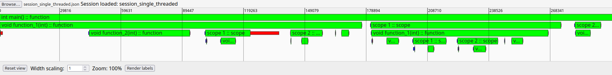

# Yet another instrumentator for your C++ projects

I was trying to improve the performance of one of my projects using `gprof` and `perf`, and after failing miserably I decided to make my own code instrumentator. Now, the main reason for this is that neither `gprof` and `perf` cannot profile scopes of functions -- to the best of knowledge, of course. That is, in a code where function A calls function B, `gprof` is perfectly capable of telling you the % of time spent in function B within the time spent in function A; `perf` will give you the similar information using the `perf record`/`perf report` commands. Both tools' outputs can be converted into nice graphs that can show you these execution times in a way that is visually intuitive, but both tools fail to be able to tell you the time spent within a scope of a function.

For example, if you had some code like this:
```c++
void A() {
    // some code ...

    {
    // probably heavy duty scope ...
    }

    // some more code ...
}
```
both tools will help you work out the cost of function A in terms of time percentages. But what about the cost of the individual scopes of function A? The time spent inside function A may not be evenly distributed and you wish to know if a specific part of that function is more costly than the others and direct your efforts towards optimizing that part.

I made a [tool](github.com/lluisalemanypuig/flame-charts) that helps you achieve this. And, no, I did not search for tools that can do this already because I thought that, of course, no one else, ever, could think of such a feature to have in a code instrumentator. And after giving you your daily dose of sarcasm, let's describe this little thingy that I made.

## Instrumenting your code

All you need to do is start a profiling session at the very first line of your `main` function
```c++
int main() {
    const bool status = PROFILER_START_SESSION(
		"session.json", "session_id"
	);
	if (not status) {
		return 1;
	}
}
```
and then add the instrumentation for the functions and scopes you want. You have two macros for this
```c++
PROFILE_FUNCTION;
PROFILE_SCOPE("scope 1");
```
I would recommend to add one for the main function, right after starting the session
```c++
int main() {
    const bool status = PROFILER_START_SESSION(
		"session.json", "session_id"
	);
	if (not status) {
		return 1;
	}
    PROFILE_FUNCTION;
}
```
You need to name every scope so that you can identify it later in the data. For example,
```c++
void A()
{
    // You don't need this i fyou just want a scope, but I recommend profiling
    // every function that contains a PROFILE_SCOPE so that the scopes can be
    // located more easily.
    PROFILE_FUNCTION;

    // some code ...

    {
        PROFILE_SCOPE("scope 1");
        for (int i = 0; i < 100; ++i) {
            // do some work...
        }
    }

    // some code ...
}
```

### Parallel code

For parallel code, you have two other macros
```c++
PROFILE_PARALLEL_FUNCTION(2);
PROFILE_PARALLEL_SCOPE("par scope", 3);
```
These two macros need the exact number of threads that the function/scope will spawn next. Unfortunately, the current behaviour of this instrumentator does not allow parallel execution and will forcefully turn your parallel application into a sequential one.

## Retrieving the time measurements

Simply compile and run your instrumented code. The execution (now much slower) will produce a file `session.json` with all the time stamps of when a function begins and when it ends. A function's data has the following format
```
{
    "c": [],
    "n": "int main()",
    "ti": "125703121684288",
    "t": "function",
    "l": "93",
    "pb": 202,
    "b": 719,
    "e": 298876,
    "pe": 298972
}
```

The format is the following:
- `c`: the measurements of all the functions and scopes within this function/scope,
- `n`: the name of the function/scope,
- `ti`: the thread id,
- `t`: the type of measurement (either a function or a scope),
- `l`: the line of code where the macro is,
- `pb`, `pe`: the beginning and end time measurements of the profiler,
- `b`, `e`: the beginning and end time measurements of the function/scope.

The `pb` and `pe` simply measure the overhead of measuring the execution time of a function/scope. Within `c` you will find more data with the same format.

### Deactivating the instrumentation

I would suggest you make a header where you can turn on and off the instrumentation by simply changing a `#define`. For example, you could have something like:
```c++
#pragma once

#define INSTRUMENTATION

#if defined INSTRUMENTATION

#include "profiler.hpp"

#else

#define PROFILER_START_SESSION(file, id) true
#define PROFILE_FUNCTION
#define PROFILE_SCOPE(name)
#define PROFILE_PARALLEL_FUNCTION
#define PROFILE_PARALLEL_SCOPE(name)

#endif
```

## Viewing the data

This instrumentator comes with an in-browser viewer to visualize this data and analyze it a bit more effectively. These are simply flame _charts_ (not to be confused with flame _graphs_). The project comes with some code examples of how to use the instrumentator. Here is a screenshot of the single-threaded example.



The image can be downloaded [here](github.com/lluisalemanypuig.github.io/blog/2025_09_27/screenshot.png).